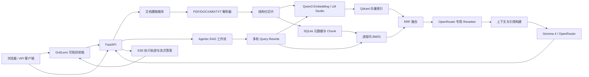

> 最后核对日期：2026-08-10。本文以当前仓库代码为准；“代码默认值”和“当前运行
> 进程配置”会明确区分，避免把临时环境变量误写成持久配置。

## 1. 文档目的

本文描述本仓库 RAG 服务的设计目标、运行架构、数据流、核心实现、API、配置、测试方法
和当前边界。目标读者是项目维护者、希望理解完整 RAG 链路的开发者，以及 AI Agent
岗位的技术面试官。

本文只记录代码中已经实现的能力。规划中的 OCR、权限系统等内容
会明确标记为“未实现”，避免把路线图误写成现状。

## 2. 设计目标

项目遵循以下原则：

1. **真实链路**：查询改写和答案生成使用 OpenRouter 免费聊天模型，Embedding 使用
   LM Studio 本地模型，向量索引使用 Qdrant。
2. **可解释**：调试响应可观察查询改写、两路召回、RRF、重排、上下文和阶段耗时。
3. **可降级**：查询改写或重排失败时保留基础 RAG 能力；当前查询改写的超时与重试仍有
   延迟风险，详见 5.1 节。
4. **有依据回答**：模型只能使用检索上下文，并且需要输出可校验的来源编号。
5. **边界清晰**：解析器、Embedding、向量库、检索、重排和生成均通过独立组件协作。

## 3. 系统架构



这里的 Agentic 工作流是显式、确定性的状态流，而不是允许模型任意循环调用工具的自主
Agent。这样更容易测试、限制延迟并定位检索问题。后续接入 LangGraph 时，可以把每个
阶段直接映射为图节点。

## 4. 文档摄取链路

### 4.1 上传与去重

服务对原始文件计算 SHA-256。相同内容且状态已经为 `ready` 时直接返回已有记录，不重复
生成向量。文件名使用 `Path(file_name).name` 取 basename，避免上传文件名造成路径穿越。

支持的扩展名为：

- `.pdf`
- `.docx`
- `.md` / `.markdown`
- `.txt`

单文件限制为 25 MB。

### 4.2 同步与异步模式

`POST /api/v1/documents` 默认同步完成解析与索引。增加查询参数
`asynchronous=true` 后，接口先保存文件和 `processing` 状态，再把处理任务提交给进程内
线程池。

异步模式适合本地演示，但它不是可靠队列：进程崩溃会丢失尚未完成的任务，多实例也无法
共享任务状态。生产部署应替换为 Celery、RQ、Arq 或消息队列，并增加重试与死信处理。

### 4.3 解析与切片

解析器输出统一的 `DocumentElement`，保留标题路径、页码、元素类型和原始位置。结构化
切片器优先维持章节边界，并通过 overlap 缓解跨 Chunk 信息断裂。

每个 Chunk 同时保存：

- `text`：提供给最终回答模型的原文；
- `embedding_text`：包含章节信息、用于向量化的检索文本；
- `heading_path`、页码、文件名和元素 ID：用于引用与排障。

### 4.4 双索引

文档向量写入 Qdrant，Chunk 原文和元数据写入 SQLite。BM25 当前从 SQLite 中的全部
Chunk 重建并保存在 API 进程内。因此文档新增或删除后，需要调用 `rebuild_lexical()`。

## 5. 问答工作流

### 5.1 查询改写

首轮问题直接检索，不产生额外模型调用。请求包含 `history` 时，`QueryRewriter` 截取最近
若干条消息，让聊天模型消解“它”“这个规则”等指代，并只输出一条独立查询。

若模型不可用、超时或返回空文本，系统自动使用原问题继续检索。

当前实现有两个必须了解的行为：

- 判断条件仅为“`history` 是否非空”，尚未判断当前问题是否真的包含指代。因此像
  “水电调度运行需要做哪些事情？”这种完整问题，只要前端携带上一轮消息，也会触发改写。
- 改写和最终生成共用 OpenRouter `google/gemma-4-26b-a4b-it:free`，不再调用 LM Studio
  的 Qwen 35B。`AUXILIARY_TIMEOUT_SECONDS=30` 是单次辅助请求超时，OpenAI SDK 仍可能
  自动重试。2026-08-10 多轮实测改写约 2.45 秒；首轮无历史时不调用聊天模型，改写阶段
  约为 0 ms。

当前前端刷新会清空内存对话历史。后续仍应改为仅对含指代的追问执行改写，并考虑独立的
轻量改写模型、短超时和 `max_retries=0`，减少免费端点拥塞时的等待。

### 5.2 混合召回

查询使用与文档完全相同的 Qwen3 Embedding 模型和维度。查询侧添加 retrieval
instruction，文档侧不添加该指令，这是 Qwen3 Embedding 推荐的非对称检索形式。

当前代码按顺序执行两路召回（尚未并发）：

- Dense：Qdrant 中的余弦相似度；
- Sparse：经过结巴搜索分词的 BM25。

两路分数不能直接相加，因为相似度与 BM25 的量纲不同。系统使用 Reciprocal Rank
Fusion，只依赖各自排名：

```text
RRF(d) = Σ 1 / (k + rank_i(d))
```

融合后还会限制同一文档进入候选集的数量，单文档上限为
`max(2, RERANK_CANDIDATE_K // 2)`，避免长文档的相邻片段完全挤占候选集。在当前默认
`RERANK_CANDIDATE_K=12` 下，单个文档最多进入 6 个候选。

### 5.3 重排

开启 `RERANK_ENABLED` 后，RRF 先保留 `RERANK_CANDIDATE_K` 个候选，再通过
OpenRouter `/api/v1/rerank` 一次性提交查询和全部候选。服务返回候选下标与相关性分数，
Provider 根据下标映射回本地 Chunk，不依赖远程返回的文档文本。
代码会校验编号范围、去除重复或非法编号。只要响应中存在合法结果，就只返回这些合法
结果，不会补齐远程模型遗漏的候选；只有空结果、畸形响应、超时或 HTTP 异常才整体退回
RRF 候选顺序。前端可根据 `source=openrouter_rerank` 或 `source=hybrid` 区分真实重排与
回退结果。

当前默认模型为 `nvidia/llama-nemotron-rerank-vl-1b-v2:free`。独立真实测试中，它将
中文年假答案排在第一，相关性分数约 0.99966，本次请求返回成本为 0。免费模型仍可能
限流或临时缺少 Provider，因此超时、HTTP 错误、空结果和异常格式均自动回退 RRF。
项目同时保留聊天模型列表式重排实现，但它会额外消耗一次免费聊天请求，且 JSON 排序
格式不如专用 reranker 稳定，因此不建议启用。

关闭 rerank 时，工作流和前端仍会显示“相关性重排”阶段，但实现只是截取候选前
`FINAL_TOP_K` 条，不调用模型；该阶段通常接近 0 ms，结果的 `source` 保持 `hybrid`。

代码和 `.env.example` 默认 `RERANK_ENABLED=false`；当前被 `.gitignore` 排除的本地
`.env` 已开启 OpenRouter reranker，并与聊天模型共用同一个本地 OpenRouter Key。真实中文
电网问题测试中首名相关性曾达到约 0.9954。复制 `.env.example` 创建新环境时，必须显式
开启 rerank 并提供 Key，否则会使用未重排的候选顺序。

### 5.4 上下文和引用

重排后的片段按顺序加入上下文，直到达到 `MAX_CONTEXT_TOKENS`。每个片段被分配
`[来源N]`，并附带文件、章节和页码。最终只返回答案实际引用的来源；如果模型未显式
引用，则返回候选来源，便于调用方追踪证据。

非流式接口会在返回前删除答案中不存在的来源编号。流式接口的 `delta` 已经发送给浏览器
后无法撤回，因此最终只会用清洗后的完整答案筛选 `citations` 事件，已经发出的非法引用
文本不会被反向修改。

### 5.5 流式输出

`POST /api/v1/query/stream` 使用 Server-Sent Events。事件顺序如下：

1. `workflow`：请求 ID 与五个工作流步骤；
2. `stage`：某阶段进入 `running`；
3. `trace`：该阶段的输入、输出、分数、分块原文与耗时；
4. `metadata`：兼容旧客户端的改写后查询，仅在查询改写阶段发送；
5. `stage`：该阶段进入 `completed`；
6. 上述 `stage → trace → stage` 依次覆盖改写、混合召回、重排和上下文构建；
7. 生成阶段发送 `stage(running)`，随后发送多个 `delta`；
8. `citations`：最终答案使用的结构化引用；
9. `stage(generate, completed)`；
10. `done`：请求 ID 和完整阶段耗时。

SSE 响应已经开始后无法修改 HTTP 状态码，因此异常通过 `error` 事件返回，不保证再发送
`done`。`stage` 目前只由服务端发送 `running` 和 `completed`；前端收到 `error` 后自行把
正在运行的节点标为失败。

客户端应按 SSE 的 `event` 字段分派消息，不能假设一次网络读取对应一个完整事件。
浏览器使用 `fetch + ReadableStream`，因为原生 `EventSource` 不支持携带 POST JSON。

### 5.6 一次提问的模型调用

| 场景 | 模型调用顺序 | 调用次数 |
|---|---|---:|
| 首轮问题，rerank 开启 | Qwen3 Embedding → NVIDIA Reranker → Gemma 4 生成 | 3 |
| 多轮问题，rerank 开启 | Gemma 4 改写 → Qwen3 Embedding → NVIDIA Reranker → Gemma 4 生成 | 4 |
| 首轮问题，rerank 关闭 | Qwen3 Embedding → Gemma 4 生成 | 2 |
| 多轮问题，rerank 关闭 | Gemma 4 改写 → Qwen3 Embedding → Gemma 4 生成 | 3 |

Qdrant 检索、BM25、RRF、上下文构建和引用校验均为本地算法，不调用模型。文档入库时会
调用 Embedding 模型生成文档向量，但这不属于每次提问的在线调用。

## 6. 数据模型

`documents` 表记录文档状态和内容哈希；`chunks` 表记录序列化后的 Chunk。向量点在
Qdrant 中使用 Chunk ID 派生的稳定 UUID，并在 payload 保存 `chunk_id` 和
`document_id`，删除文档时可以按 `document_id` 过滤清理。

文档状态包括：

- `processing`：等待或正在索引；
- `ready`：可以参与检索；
- `failed`：处理失败，`error` 中保存原因；
- `ocr_required`：PDF 基本没有可提取文本，需要 OCR。

## 7. API

| 方法 | 路径 | 说明 |
|---|---|---|
| `GET` | `/` | GridLens 可观测 RAG 前端 |
| `GET` | `/static/*` | 前端 CSS 与 JavaScript 静态资源 |
| `GET` | `/health` | API 进程存活检查 |
| `POST` | `/api/v1/documents` | 同步上传；可用 `asynchronous=true` 后台索引 |
| `GET` | `/api/v1/documents` | 列出文档 |
| `GET` | `/api/v1/documents/{id}` | 查询索引状态 |
| `DELETE` | `/api/v1/documents/{id}` | 删除文件、SQLite Chunk 和 Qdrant 向量 |
| `POST` | `/api/v1/query` | 非流式问答 |
| `POST` | `/api/v1/query/stream` | SSE 流式问答 |

请求 `debug=true` 时会增加 `rewritten_query`、`workflow`、`dense`、`lexical`、
`fused`、`reranked`、最终上下文和各阶段耗时。生产接口不应默认开启，以免暴露文档原文。
非流式 debug 中 Dense、BM25 和 RRF 只返回 Chunk ID 与分数；流式 `trace` 为了支持前端
排障，会补全文件名、章节、页码和完整分块原文，因此同样需要访问控制。

## 8. 关键配置

| 配置项 | 默认值 | 含义 |
|---|---:|---|
| `CHAT_BASE_URL` | `https://openrouter.ai/api/v1` | 查询改写和答案生成接口 |
| `CHAT_MODEL` | `google/gemma-4-26b-a4b-it:free` | 最终答案及查询改写共用的免费聊天模型 |
| `EMBEDDING_MODEL` | `text-embedding-qwen3-embedding-0.6b` | 文档和问题向量模型 |
| `EMBEDDING_DIMENSION` | 1024 | Qdrant collection 向量维度 |
| `QDRANT_COLLECTION` | `rag_qwen3_local_1024` | 当前向量集合 |
| `DENSE_TOP_K` | 30 | 向量召回数量 |
| `LEXICAL_TOP_K` | 30 | BM25 召回数量 |
| `RERANK_CANDIDATE_K` | 12 | 送入重排器的候选上限 |
| `FINAL_TOP_K` | 6 | 最终上下文候选数量 |
| `RRF_K` | 60 | RRF 排名平滑常数 |
| `QUERY_REWRITE_ENABLED` | true | 是否对多轮追问执行改写 |
| `RERANK_ENABLED` | false | 是否启用专用重排；配置 Key 后开启 |
| `RERANK_PROVIDER` | openrouter | `openrouter` 或备用的 `llm` |
| `RERANK_MODEL` | `nvidia/llama-nemotron-rerank-vl-1b-v2:free` | OpenRouter Rerank 模型 ID |
| `RERANK_TIMEOUT_SECONDS` | 30 | 专用 Rerank API 超时 |
| `MAX_HISTORY_MESSAGES` | 6 | 查询改写读取的最近消息数 |
| `AUXILIARY_TIMEOUT_SECONDS` | 30 | 查询改写和 LLM 重排的单次超时 |
| `MAX_CONTEXT_TOKENS` | 6000 | 最终上下文预算 |

更换 Embedding 模型、维度、量化方式或查询指令后，必须使用新的 Qdrant collection 并
重新索引全部文档，不能混用旧向量。

配置优先级由 Pydantic Settings 决定：进程环境变量可覆盖 `.env` 和代码默认值。文档中的
“默认值”是代码默认配置，不代表某个已启动进程一定使用该值。密钥只应通过本地 `.env`
（确保不入库）或进程环境变量提供，绝不能进入浏览器代码和技术文档。

## 9. 本地运行与验证

```powershell
docker compose up -d qdrant
uv sync --dev
uv run uvicorn app.main:app --reload
```

访问 `http://127.0.0.1:8000/` 使用 GridLens 前端；访问
`http://127.0.0.1:8000/docs` 调试接口。自动化验证命令：

```powershell
uv run pytest
uv run ruff check .
uv run python -m scripts.smoke_test
```

真实浏览器冒烟测试位于 `scripts/ui_smoke.cjs`，会验证首页、知识库弹窗、SSE 五阶段执行
链、分块展开、流式答案和浏览器控制台，并输出 `data/ui-smoke.png`。它依赖 Playwright
运行时和可用的 Chromium/Chrome。

截至 2026-08-10，自动化测试为 14 项通过，Ruff 和 JavaScript 语法检查通过。使用已入库
的《电网运行规则（试行）》进行小样本测试时，4 个问题中 3 个端到端通过：单分块明确
条款与知识库外拒答表现正常；第二十条九项并网条件虽然召回和重排正确，但生成模型错误
拒答，说明跨分块长列表整合仍是当前可靠性短板。该 3/4 只是小样本结果，不能视为生产
准确率。

测试中的 Mock 只替代外部模型和向量库，用于快速验证业务逻辑；应用默认配置使用真实
LM Studio 与 Qdrant。

## 10. 安全与可靠性

当前提示词明确把检索资料视为数据，降低文档内提示词注入覆盖系统规则的风险；生成后
还会校验引用编号。但生产环境仍需要补充：

- 身份认证、知识库权限和检索阶段的 metadata filter；
- 上传文件病毒扫描、MIME 检查和更严格的资源限制；
- API 限流、模型超时、熔断和重试；
- 密钥管理，禁止把真实 API Key 写入仓库或聊天记录；
- SQLite、上传文件与 Qdrant 的一致性备份；
- debug 接口访问控制和日志脱敏。
- SSE `trace` 访问控制；它包含召回分块原文和最终模型上下文。

## 11. 已知边界与演进方向

目前尚未实现：

1. 扫描 PDF OCR、复杂表格和图片语义抽取；
2. 父子 Chunk、条款级 Chunk、Multi-Query、HyDE 和自动重试检索；
3. 基于 rerank 最低相关度的硬拒答；当前低分问题仍可能附带无关引用；
4. 按需查询改写、独立轻量改写模型、硬超时和关闭辅助请求自动重试；
5. 跨相邻 Chunk 的证据扩展，长列表条款可能召回正确但生成失败；
6. 持久化任务队列和可恢复的任务进度；
7. 多租户、权限过滤和多个知识库；
8. Prometheus、OpenTelemetry、Langfuse 等后端可观测平台；当前只有页面级执行轨迹；
9. LangGraph 工具调用、自主循环和 Human-in-the-loop；
10. 前端删除文档、清空对话、取消生成和持久化聊天记录；当前前端支持问答、上传与列表。

建议下一阶段优先修复查询改写延迟，加入 rerank 阈值、条款级切分/相邻 Chunk 扩展，并
建立固定评估集；随后再加入 OCR 和权限过滤。只有当系统确实需要调用多个外部工具或根据
证据质量循环检索时，再引入 LangGraph，避免为了框架增加不必要的状态复杂度。
